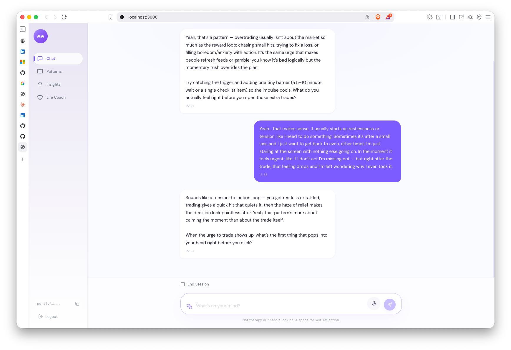
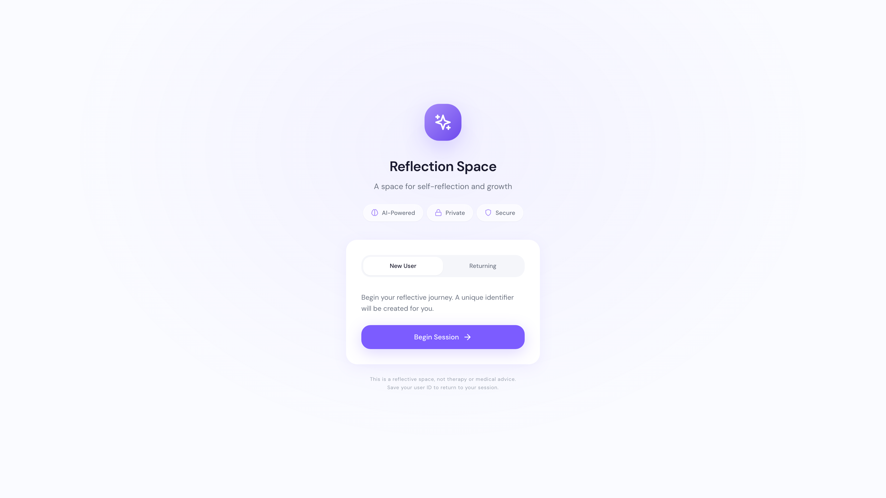
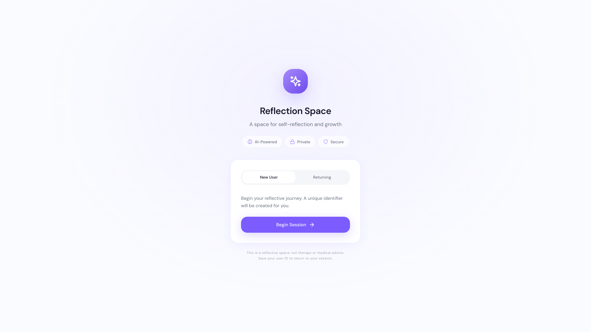

# 🧠 Psycho Trader AI

[](https://opensource.org/licenses/MIT)
[](https://www.python.org/downloads/)
[](https://www.typescriptlang.org/)
[](https://fastapi.tiangolo.com/)
[](https://react.dev/)

**A psychoanalytically-oriented reflection system for traders**

Built to help traders understand the psychological patterns behind their trading behavior. Not therapy, not financial advice—a space for genuine self-reflection powered by AI.

🔗 **[View Demo](#)** | 📖 **[Documentation](#)** | 💬 **[Discussions](https://github.com/aayushnamdev/psycho-trader-ai/discussions)**

---

## 🎯 Philosophy

> "I use Claude, Gemini, and GPT as technical copilots, but I own every architecture decision, every system design choice, every product call."

This project represents a fusion of modern AI capabilities with thoughtful product design. Every technical decision—from the memory architecture to the conversation flow—is intentional and human-driven.

---

## ✨ What Makes This Different

### 1. **Memory Architecture**
Not just chat history. The system maintains **case notes**—psychoanalytic observations about patterns, fears, and behavioral tendencies. Like a therapist's notes, but algorithmic.

- **Pattern Recognition**: Automatically identifies recurring themes (loss aversion, FOMO, fear of success)
- **Contextual Continuity**: References past conversations naturally
- **Relationship Building**: Tracks engagement metrics (streaks, conversation depth)

### 2. **Conversational Design**
Inspired by Reflection.app's interface but built for trading psychology:
- Clean, pill-shaped chat input
- Suggestion pills for common reflection topics
- Warm but direct tone—no therapy-speak

### 3. **Gamification Layer**
- Achievement system for milestones (first conversation, 7-day streak, breakthroughs)
- Streak tracking to encourage consistent reflection
- Progressive relationship depth (1-5 scale)

---

## 🏗️ Architecture

### **Backend** (Python/FastAPI)
```
/sessions       # Conversation orchestration
/memory         # Case note formation & retrieval
/brain          # AI interpretation layer (OpenAI GPT-5 mini)
/db             # SQLAlchemy ORM (SQLite/PostgreSQL)
```

**Key Design Patterns:**
- **Repository Pattern**: Clean separation of data access from business logic
- **Service Layer**: Orchestrates complex workflows (memory formation, pattern recognition)
- **Dependency Injection**: FastAPI's DI for database sessions

### **Frontend** (React/TypeScript/Vite)
```
/components     # UI components (chat, dashboard, patterns)
/contexts       # State management (auth, chat)
/services       # API client layer
/hooks          # Custom React hooks (auto-journal, achievements)
```

**Tech Stack:**
- **React 18** with TypeScript
- **Tailwind CSS** for styling
- **Recharts** for analytics visualization
- **Lucide Icons** for UI
- **Axios** for API calls

### **Database Schema**
```sql
users         → User profiles & relationship stats
memories      → Psychoanalytic observations (case notes)
sessions      → Interaction transcripts
achievements  → Gamification milestones
```

---

## 📸 Screenshots

> **Note**: Screenshots are being added. See [SCREENSHOT_GUIDE.md](docs/SCREENSHOT_GUIDE.md) for details on the UI features.

**Coming soon**:
- Chat Interface - Clean, Reflection.app-inspired design with suggestion pills
- Patterns Dashboard - Visualize recurring psychological patterns over time
- Analytics View - Track engagement metrics and insights
- Achievement System - Celebrate milestones and maintain streaks

<!-- Placeholder for screenshots -->
<!--  -->
<!--  -->
<!--  -->
<!--  -->

---

## 🚀 Getting Started

### Prerequisites
- Python 3.12+
- Node.js 18+
- OpenAI API Key (GPT-5 mini access)

### Installation

1. **Clone the repository**
```bash
git clone https://github.com/aayushnamdev/psycho-trader-ai.git
cd psycho-trader-ai
```

2. **Backend Setup**
```bash
# Create virtual environment
python -m venv venv
source venv/bin/activate  # On Windows: venv\Scripts\activate

# Install dependencies
pip install -r requirements.txt

# Set up environment variables
cp .env.example .env
# Edit .env and add your OPENAI_API_KEY

# Initialize database
python -c "from db.connection import init_db; init_db()"

# Run backend
uvicorn app:app --reload
```

3. **Frontend Setup**
```bash
cd frontend
npm install
npm run dev
```

4. **Access the app**
- Frontend: http://localhost:3000
- Backend API: http://localhost:8000
- API Docs: http://localhost:8000/docs

---

## 🗺️ Roadmap

### ✅ Phase 1: Core Reflection System (Complete)
- [x] Psychoanalytic conversation engine
- [x] Memory formation & retrieval
- [x] Pattern recognition
- [x] Chat interface with suggestion pills
- [x] Basic dashboard

### ✅ Phase 2: Gamification (Complete)
- [x] Achievement system
- [x] Streak tracking
- [x] Relationship depth metrics
- [x] Celebration UI

### 🚧 Phase 3: Life Coach Integration (In Progress)
**Objective**: Personalized coaching based on recognized patterns

**Features**:
- [ ] **Pattern-Based Coaching**: AI coach that references your specific recurring themes
  - Example: "I notice you've mentioned fear of success 8 times. Let's work on that."

- [ ] **Goal Setting**: Track trading psychology goals
  - "I want to hold winners longer"
  - "I want to reduce revenge trading"

- [ ] **Personalized Exercises**: CBT-inspired exercises tailored to your patterns
  - Journaling prompts based on your fears
  - Reframing exercises for loss aversion
  - Mindfulness techniques for FOMO

- [ ] **Progress Tracking**: Visualize improvement over time
  - Pattern frequency charts
  - Sentiment analysis of journal entries
  - Breakthrough moment timeline

- [ ] **Smart Check-ins**: Proactive nudges based on behavior
  - "You haven't reflected in 3 days. Streak at risk."
  - "You mentioned work stress last week. How's it going?"

### 🔮 Phase 4: Advanced Features (Future)
- [ ] Voice input for journaling
- [ ] Mobile app (React Native)
- [ ] Export journal entries to PDF
- [ ] Integration with trading platforms (track P&L correlation with emotional state)
- [ ] Community features (anonymized pattern sharing)
- [ ] Multi-language support

---

## 🎨 Design Decisions

### Why Psychoanalytic?
Traditional trading journals focus on *what* happened. This system focuses on *why* you behaved that way. The goal is insight, not just record-keeping.

### Why Case Notes Instead of Chat History?
Chat logs grow infinitely. Case notes are **curated observations**—the system decides what's worth remembering. This creates a more human-like relationship memory.

### Why GPT-5 Mini?
- Fast response times for real-time chat
- Lower cost for frequent interactions
- Sufficient for conversational nuance
- Uses **Responses API** for cleaner integration

### Why SQLite for Default DB?
Easy setup for local development. Designed to scale to PostgreSQL for production without code changes (just swap DATABASE_URL).

---

## 🧪 Technical Highlights

### 1. **Memory Extraction Pipeline**
After each conversation:
1. AI extracts "worth remembering" moments
2. Categorizes by psychological pattern
3. Assigns relevance score (1-10)
4. Stores with follow-up questions for future

### 2. **Context Building**
Before generating a response:
1. Retrieve recent observations (last 5)
2. Retrieve high-relevance patterns (top 5)
3. Retrieve recent interactions (last 3)
4. Build relationship context (days together, streak)
5. Feed to AI for continuity

### 3. **Pattern Recognition**
Categories include:
- `fear_patterns`: Loss aversion, FOMO, fear of success
- `recurring_struggle`: Persistent behavioral loops
- `defense_mechanisms`: Rationalization, denial
- `breakthrough_moment`: Insights and realizations
- `identity_statement`: "I am..." statements
- `relationship_dynamics`: How they relate to others

### 4. **Achievement Engine**
Checks after each interaction:
- First step (first conversation)
- Consistent reflector (3 sessions)
- Week warrior (7-day streak)
- Month master (30-day streak)
- Pattern breaker (recognized 5+ patterns)

---

## 📝 API Overview

### Core Endpoints

#### POST `/api/session`
Send a message and get psychoanalytic response
```json
{
  "user_input": "I closed my trade too early again",
  "user_id": "trader_123"
}
```

#### POST `/api/session/end`
End session with summary
```json
{
  "user_id": "trader_123"
}
```

#### GET `/api/user/{user_id}/stats`
Get dashboard statistics

#### GET `/api/user/{user_id}/patterns`
Get recognized pattern categories

#### GET `/api/user/{user_id}/achievements`
Get unlocked achievements

Full API documentation: http://localhost:8000/docs

---

## 🔐 Privacy & Ethics

- **No data selling**: Your reflections stay private
- **Local-first option**: Can run entirely on your machine
- **Explicit disclaimers**: Not therapy, not financial advice
- **Transparent AI**: Clear when you're talking to an algorithm

---

## 🛠️ Development

### Run Tests
```bash
pytest tests/
```

### Code Quality
```bash
# Format code
black .

# Type checking
mypy .

# Linting
pylint sessions/ memory/ brain/
```

### Database Migrations
```bash
# If using Alembic (optional)
alembic revision --autogenerate -m "description"
alembic upgrade head
```

---

## 🤝 Contributing

This is a personal portfolio project, but feedback and ideas are welcome! If you're interested in:
- Trading psychology
- AI-powered self-reflection tools
- Thoughtful product design

Let's connect on [LinkedIn](https://linkedin.com/in/aayushnamdev) or [GitHub](https://github.com/aayushnamdev)

---

## 📄 License

MIT License - See [LICENSE](LICENSE) for details

---

## 💡 Acknowledgments

**Design Inspiration**: Reflection.app (for the clean chat UI)
**AI**: OpenAI GPT-5 mini (via Responses API)
**Philosophy**: Psychoanalytic theory (Freud, Jung, modern CBT)

---

## 📬 Contact

Building at the intersection of AI and human behavior. If that resonates, I'd love to connect.

**GitHub**: [@aayushnamdev](https://github.com/aayushnamdev)
**LinkedIn**: [Aayush Namdev](https://linkedin.com/in/aayushnamdev)
**Portfolio**: Coming soon

---

*"The unexamined trade is not worth taking."* – Probably Socrates, if he day-traded
